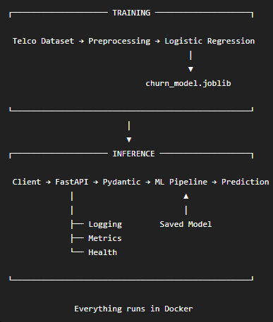
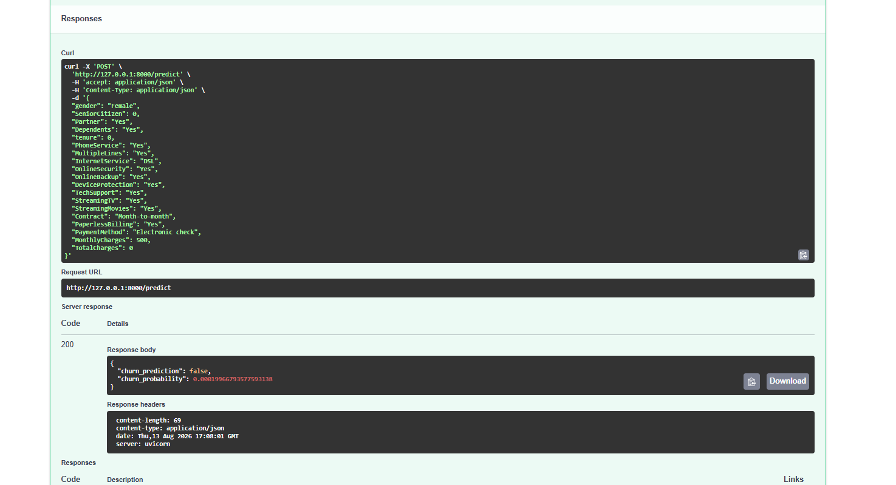
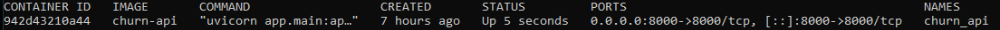
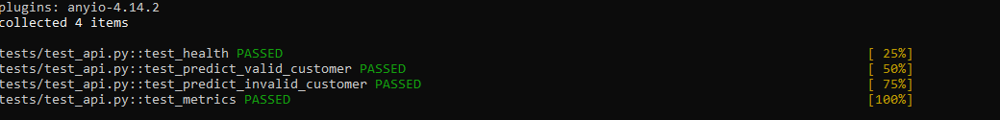

# Production ML API – Customer Churn Prediction

A production-style machine learning service for predicting customer churn, built with **scikit-learn, FastAPI, Pydantic, Docker, and pytest**.

The project demonstrates the full workflow from raw customer data and model training to a containerized REST API with input validation, automated testing, logging, and basic monitoring.

## Architecture



## Machine Learning Pipeline

The model predicts whether a telecommunications customer is likely to churn.

The dataset contains **7,043 customers** with information including:

- tenure
- contract type
- internet service
- payment method
- monthly charges
- total charges
- support services
- demographic and account information

The target variable is:

```text
Churn

0 = Customer stays
1 = Customer churns
```

### Preprocessing

The preprocessing and classifier are combined into a single scikit-learn `Pipeline`.

Numerical features are processed using:

- median imputation for missing values
- standard scaling

Categorical features are processed using:

- one-hot encoding
- handling of previously unseen categories

Keeping preprocessing inside the model pipeline ensures that the same transformations used during training are automatically applied during inference.

## Model Selection

Two models were evaluated using **5-fold stratified cross-validation**.

| Metric | Logistic Regression | Random Forest |
|---|---:|---:|
| Accuracy | 0.802 | 0.786 |
| Precision | 0.653 | 0.626 |
| Recall | 0.543 | 0.485 |
| F1 | 0.592 | 0.546 |
| ROC-AUC | **0.846** | 0.821 |

Logistic Regression produced the strongest overall validation performance and was selected as the final model.

### Final Test Performance

The selected model was evaluated on the held-out test set.

| Metric | Score |
|---|---:|
| Accuracy | 0.806 |
| Precision | 0.657 |
| Recall | 0.559 |
| F1 | 0.604 |
| ROC-AUC | **0.842** |

The complete trained pipeline is serialized to:

```text
models/churn_model.joblib
```

The API loads this artifact directly and does not retrain the model during startup.

## REST API

The trained model is exposed through a **FastAPI REST service**.

### Endpoints

| Method | Endpoint | Purpose |
|---|---|---|
| `GET` | `/health` | Check service availability |
| `POST` | `/predict` | Generate a churn prediction |
| `GET` | `/metrics` | View basic inference metrics |

Interactive API documentation is automatically provided by FastAPI at:

```text
http://localhost:8000/docs
```

## Prediction Example

Example request to `POST /predict`:

```json
{
  "gender": "Female",
  "SeniorCitizen": 0,
  "Partner": "No",
  "Dependents": "No",
  "tenure": 2,
  "PhoneService": "Yes",
  "MultipleLines": "No",
  "InternetService": "Fiber optic",
  "OnlineSecurity": "No",
  "OnlineBackup": "No",
  "DeviceProtection": "No",
  "TechSupport": "No",
  "StreamingTV": "Yes",
  "StreamingMovies": "Yes",
  "Contract": "Month-to-month",
  "PaperlessBilling": "Yes",
  "PaymentMethod": "Electronic check",
  "MonthlyCharges": 95.5,
  "TotalCharges": 191.0
}
```

Example response:

```json
{
  "churn_prediction": true,
  "churn_probability": 0.85
}
```

## Input Validation

Pydantic schemas validate incoming requests before they reach the model.

Validation includes:

- accepted categorical values
- binary fields
- numeric data types
- non-negative tenure and charge values
- optional missing `TotalCharges`

Invalid requests return an HTTP `422` response rather than being passed to the inference pipeline.

## Logging

Prediction requests generate application logs containing operational information such as:

```text
prediction=1 probability=0.8531 latency_ms=4.82
```

This provides visibility into individual inference requests without logging the complete customer payload.

## Monitoring

The `/metrics` endpoint provides basic runtime monitoring, including:

- total predictions
- predicted churn count
- predicted stay count
- average churn probability
- average inference latency

These metrics are stored in memory and reset when the application restarts. In a larger production environment, they could be exported to a dedicated monitoring platform such as Prometheus.

## Automated Tests

API behavior is tested using `pytest` and FastAPI's test client.

Current tests verify:

- health endpoint availability
- successful prediction requests
- rejection of invalid customer data
- monitoring endpoint structure

Run the test suite with:

```bash
python -m pytest -v
```

The current test suite contains four API tests:

```text
test_health
test_predict_valid_customer
test_predict_invalid_customer
test_metrics
```

## Docker

The application is containerized so that the API, Python runtime, dependencies, application code, and trained model can run consistently across environments.

Build the Docker image:

```bash
docker build -t churn-api .
```

Run a new container:

```bash
docker run --name churn_api -p 8000:8000 churn-api
```

If the container has already been created and is currently stopped:

```bash
docker start churn_api
```

Verify that the container is running:

```bash
docker ps
```

Then access the interactive API documentation at:

```text
http://localhost:8000/docs
```

## Running Locally

Install the required dependencies:

```bash
pip install -r requirements.txt
```

Train and save the model:

```bash
python training/train.py
```

Start the API:

```bash
uvicorn app.main:app --reload
```

The service will be available at:

```text
http://localhost:8000
```

## Project Structure

```text
production-ml-api/
|
+-- app/
|   +-- __init__.py
|   +-- main.py
|   +-- schemas.py
|
+-- data/
|   +-- raw/
|       +-- telco_churn.csv
|
+-- models/
|   +-- churn_model.joblib
|
+-- tests/
|   +-- __init__.py
|   +-- test_api.py
|
+-- training/
|   +-- train.py
|
+-- docs/
|   +-- architecture.png
|   +-- api_prediction.png
|   +-- docker_running.png
|   +-- tests_passed.png
|
+-- .dockerignore
+-- .gitignore
+-- Dockerfile
+-- requirements.txt
+-- README.md
```

## Tech Stack

**Machine Learning:** Python, pandas, scikit-learn  
**API:** FastAPI, Pydantic, Uvicorn  
**Testing:** pytest  
**Deployment:** Docker  
**Model Serialization:** joblib  
**Monitoring:** Python logging and runtime inference metrics

## Key Engineering Concepts Demonstrated

This project demonstrates:

- reproducible ML preprocessing and inference pipelines
- train/test separation and stratified cross-validation
- model comparison and evaluation
- model serialization
- REST API model serving
- request schema validation
- containerized deployment
- automated API testing
- inference logging
- basic service monitoring

## Demo

### Prediction API



### Containerized Service



### Automated Tests



## Future Improvements

Potential extensions toward a more complete production ML system include:

- deploy the Docker image to a cloud platform
- add CI/CD for automated testing and deployment
- export service metrics to Prometheus/Grafana
- add model and data drift monitoring
- add authentication and rate limiting
- introduce model versioning